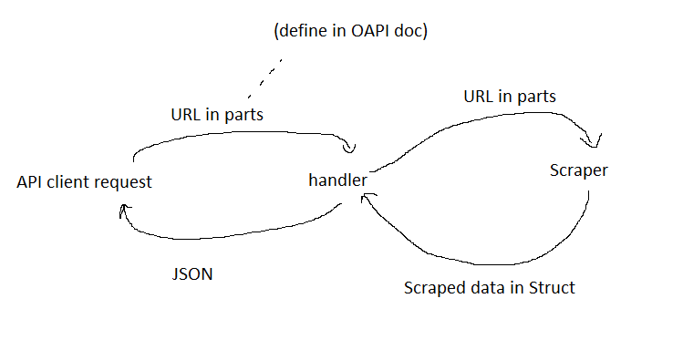

# Skelbiu API

A Go REST API that serves scraped skelbiu.lt listings.

## Table of Contents

- [Skelbiu API](#skelbiu-api)
  - [Table of Contents](#table-of-contents)
  - [Project Description](#project-description)
    - [Tech Stack](#tech-stack)
    - [Features](#features)
    - [Project Structure](#project-structure)
  - [Getting started](#getting-started)
  - [Design Notes](#design-notes)
    - [Process Flow Diagram](#process-flow-diagram)
    - [Planned features](#planned-features)

## Project Description

This project implements an API representation of public Skelbiu.lt listings, which is particularly useful for listing analyses via LLMs (e.g. "best deal" finder).
Aside from that, it serves as a personal training ground for learning Go's networking and API development fundamentals, both in serving and receiving HTTP requests, as well as best practices in production environments.

### Tech Stack

- **Go** - Main language for the backend
  - **Colly** - Web scraping framework
  - **uTLS** - TLS browser impersonator
- **Google Cloud Run** - Hosting the production server
- **Postman** - API endpoint testing
- **Air** - Live reload for development

### Features

- Full OpenAPI specifications
- Integrated Postman `Local` and `Prod` environments
- Ready-to-use Air and Postman configs
- Full unit testing/benchmarks suite
- Parallel page scraping

### Project Structure

- `cmd/api` - Application entry point
- `api` - OpenAPI spec (`openapi.yaml`)
- `internal` - Internal packages and implementation logic
  - `internal/handler` - API HTTP handlers/parsers and routing
  - `internal/model` - Class definitions and methods
  - `internal/scraper` - Scraper implementation
- `postman` - Postman collections and environments for testing

## Getting started

The live server can be run with *air*:

```cmd
air
```

If you want to run it manually instead, use:

```cmd
go run ./cmd/api
```

To use a custom port, set `PORT` first:

```cmd
set PORT=8081
go run ./cmd/api
```

## Design Notes

- LLMs were only used for answering technical questions and setup creation, in order to necessitate personal learning. For instance, all documentation was hand written by me :p
- Go's stdlib was used as much as possible, with the exception of a scraping framework ([Colly](https://github.com/gocolly/colly)) and a TLS browser impersonator ([uTLS](https://github.com/refraction-networking/utls))
- The project's file structure was build from the ground up to comply with standard practices
- A lack of caching/storage was a deliberate choice, as this avoids possible violations of EU's GDPR laws

### Process Flow Diagram

Our greatest scientists have created this wonderful process flow chart to illustrate the API's architecture and data flow:



### Planned features

- Opt-in listing caching w/ Redis
- Front-end API demo
